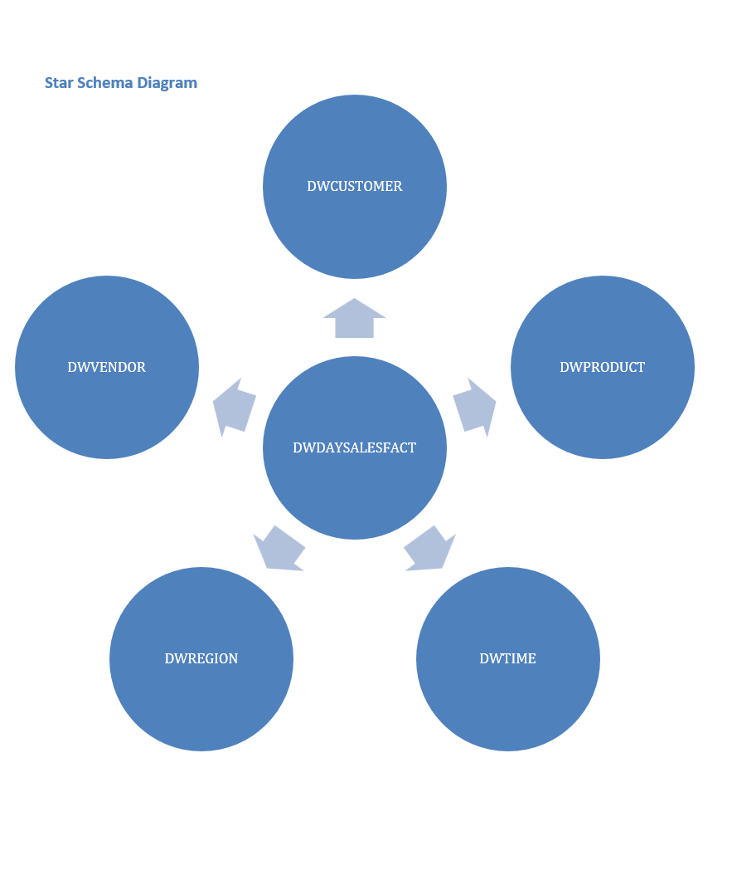
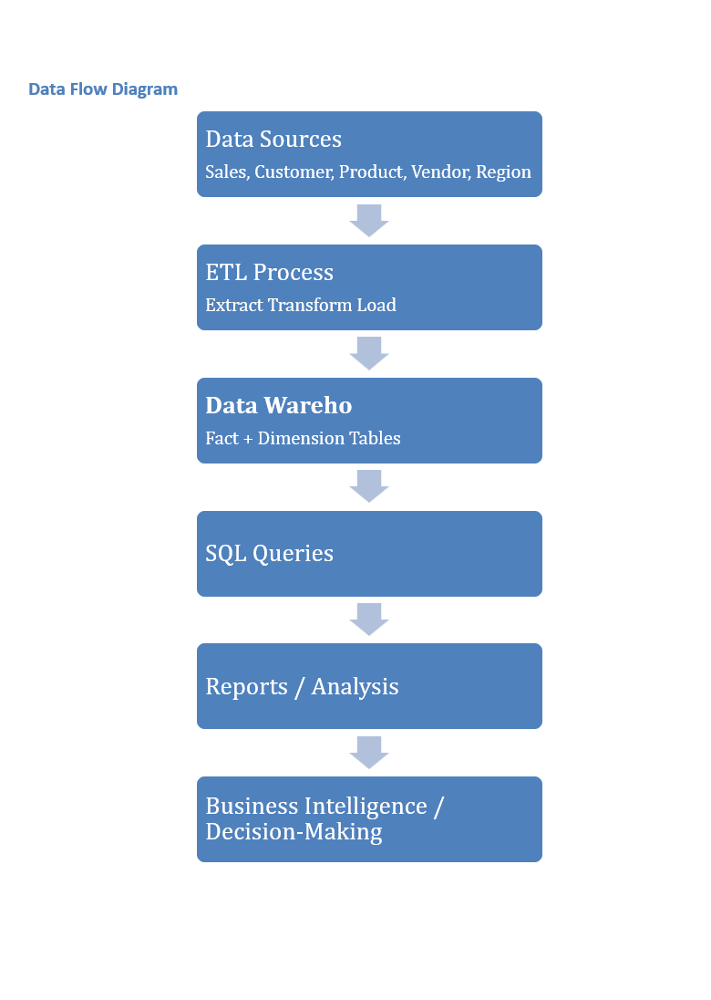
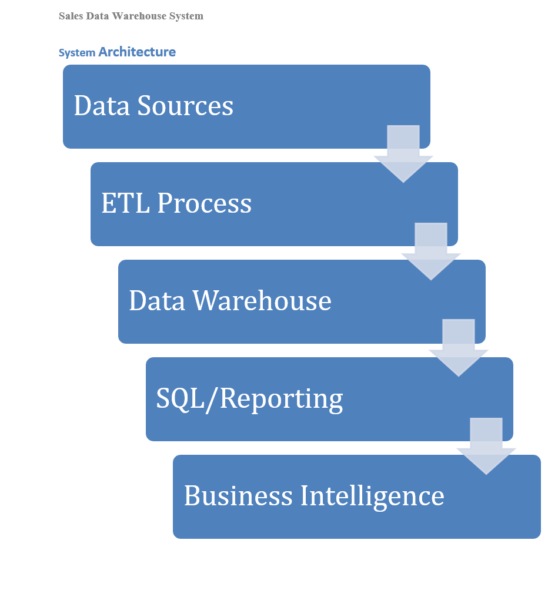
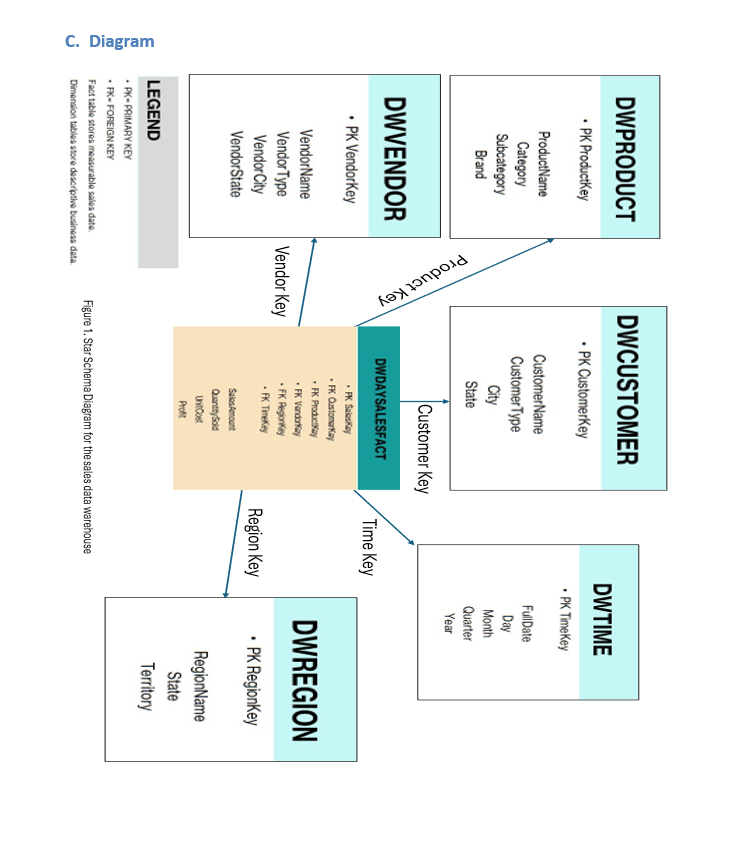

# Sales Data Warehouse and Business Intelligence System

## Overview
This project demonstrates the design and implementation of a Sales Data Warehouse using a star schema to support business intelligence and decision-making.

## System Architecture
The system consists of:
- Data Sources (sales, customer, product, vendor, region)
- ETL Process (Extract, Transform, Load)
- Data Warehouse (Star Schema)
- Query and Reporting Layer

## Database Structure
The warehouse includes:

### Fact Table
- DWDAYSALESFACT

### Dimension Tables
- DWCUSTOMER
- DWPRODUCT
- DWVENDOR
- DWREGION
- DWTIME

## Implementation
The system is implemented using SQL scripts to:
- Create tables
- Load data
- Perform analytical queries

## Sample Query
```sql
SELECT r.RegionName, SUM(f.SalesAmount) AS TotalSales
FROM DWDAYSALESFACT f
JOIN DWREGION r ON f.RegionKey = r.RegionKey
GROUP BY r.RegionName;
## System Diagrams

### Star Schema


### Data Flow Diagram


### System Architecture


### Detailed Schema


## Files Included
- [Schema](schema.sql)
- [Sample Data](sample_data.sql)
- [Queries](queries.sql)

## How to Run
1. Run schema.sql
2. Run sample_data.sql
3. Run queries.sql
